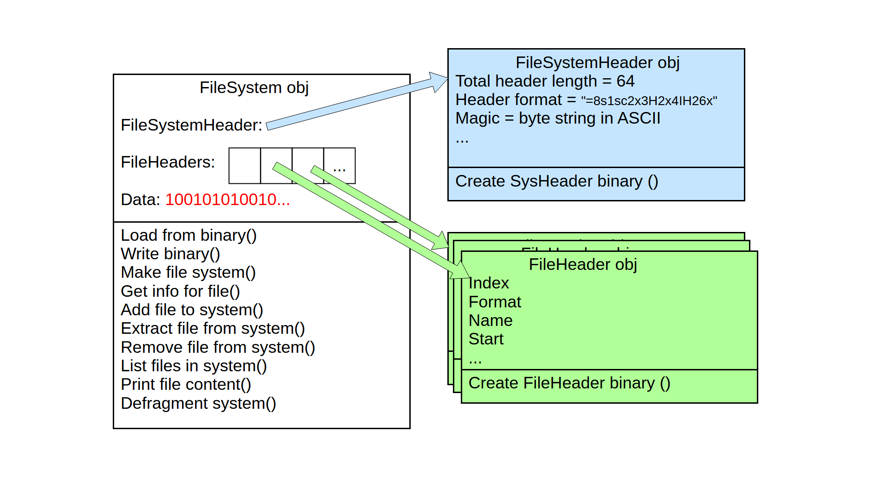

# Code walkthrough:
## Main:
Main saves name of file system, operation and arguments, then creates FileSystem obj





## FileSystem Class
### FileSystem creation
- saves attributes name, operation, arguments, functions
- checks if operation is mkfs (differs because no binary can be loaded): makes objects
- if not: func: load binary into objects
- func: executes function on objects
- func: writes new binary from objects

FileSystem has objects:
- File System Header obj (fields from assignment paper as attributes)
- List of File Header obj (fields from assignment paper as attributes and index in list based on start position in byte array)
- Raw binary of data (not a class obj, but build in binary obj)

### load_from_binary()

Generates dummy File System header (technically possible to just hardcode total file header to 64 bytes, but bad if it should be changed in File System Header obj and forgotten here -> dummy FSHeader to read total file header size)
reads and saves whole binary
generates FS Header obj by passing binary slice for FS header

Generates an empty list for file entries
populates this list by iterating over binary in range of file entries with entry size chunks
- generating new FileEntry obj by passing binary
- appending this obj to list
- saving its index to obj.

saves rest of data (file data) as binary

### write_binary()
- calls binary creation method of obj
- concatenates all binary
- concatenates raw binary of data
Writes data to file system given by name

### make_file_system()
Generates new FileSystemHeader obj
Generates new FileHeader obj in list of size saved as attribute in FS Header obj
Generates empty byte string for data, so that self.data is defined

### get_info_for_file()
- Checks that no arguments are provided
- Reads file counts from file system header
- Free entries calculation: subtracts both active and deleted files from total capacity (32), as deleted files still occupy space until defragmentation
- Total size calculation: sums the (fixed) header size (64 bytes), the complete (fixed) file entry table size (32 * 64 bytes), and the length of the binary data
- Prints the information to the console

### add_file_to_file_system()
Checks numbers of arguments, if free entries possible, if no space left, if name is not longer than 32 bytes, checks if already file with this name exists.

Reads and saves file content binary

Creates new FileHeader obj, adjusts attributes according to new file data.
Creates and appends zero padding to fill Block of 64 bytes and appends it to file data.

Adjusts file header entries for a new file (offset free entry, offset new data, file count).

### extract_file_from_file_system()
Similar to show_content(), but instead of printing the content to the console, it writes the file content to the local disk (by creating a new file with the provided file name)

### remove_file_from_file_system()
checks if only 1 argument
checks if file is existing in file headers
    - true: change flag to 1, increment deleted files count, and decrement active file count
    - false: assertion

### list_files_in_file_system()
- Checks that no arguments are provided
- Iterates through the list of file headers
- Filtering: selects only files that have a name (no empty slots) and that are not marked as deleted, thus printing only active files
- Prints name, size, and creation time for each active file in the file system

### print_file_contents()
- checks if only one argument
- checks if a file is found with loop and saves header object
- calculates offset in saved data with start and offset begin of all data
- prints content to console
(getfs similar, saving the file to disc with name in header obj)

### defragment_file_system()
- Iterates backwards through the file headers (to safely remove items without disrupting the iteration index)
- Identifies files marked as deleted
- Slices the binary data to remove the deleted content of the file
- Iterates thorugh the remaining file headers and moves the start offset of any file that is located after the deleted part so that they point to the correct data location
- Resets global delete counter to 0 and prints how many files were defragmented and how many bytes of file data were freed

## Class FileSystemHeader
#### creation:
Either reads binary and saves attributes or creates new system header (attributes given by assignment)

#### create_filesystem_header_binary: 
Packs and concatenates binary from current attributes
returns binary data

## Class FileHeader:
One obj for each file entry
Either reads binary and saves attributes or creates new empty entry obj (attributes adjusted by function addfs)

### generate_file_header_bytes()

Packs and concatenates binary from current attributes
returns binary data

# Step 01: Python demonstration
## 1. Create a new filesystem called filesystem1.zvfs

    python zvfs.py mkfs filesystem1.zvfs

no output

## 2. Create two test text files
    echo "Hello, world!" > test_file1.txt
    echo "The weather is nice today" > test_file2.txt

no output
## 3. Add both files to the filesystem
    python zvfs.py addfs filesystem1.zvfs test_file1.txt
    python zvfs.py addfs filesystem1.zvfs test_file2.txt
no output

## 4. List all filesystem files
    python zvfs.py lsfs filesystem1.zvfs

Output: 

    Name: test_file1.txt, size (in bytes): 30, creation time: 1765208343.7181046
    Name: test_file2.txt, size (in bytes): 56, creation time: 1765208408.2794857
    
## 5. Print contents of test file1.txt from the filesystem
    python zvfs.py catfs filesystem1.zvfs test_file1.txt
Output:

    b'Hello, world!\n'

## 6. Delete file test file1.txt from your disk, and restore it from the filesystem
    rm test_file1.txt
    python zvfs.py getfs filesystem1.zvfs test_file1.txt

No output

## 7. Get the information of the filesystem
    python zvfs.py gifs filesystem1.zvfs

Output:

    File name: filesystem1.zvfs
    Number of files present (non deleted): 2
    Remaining free entries for new files (excluding deleted files): 30
    Number of files marked as deleted: 0
    Total size of the file: 2240

## 8. Delete test file1.txt from the filesystem, and then get the information of the filesystem and list all filesystem files
    python zvfs.py rmfs filesystem1.zvfs test_file1.txt
    python zvfs.py gifs filesystem1.zvfs
    python zvfs.py lsfs filesystem1.zvfs
Output:

    File name: filesystem1.zvfs
    Number of files present (non deleted): 1
    Remaining free entries for new files (excluding deleted files): 30
    Number of files marked as deleted: 1
    Total size of the file: 2240

    Name: test_file2.txt, size (in bytes): 56, creation time: 1765208408.2794857

## 9. Defragment the filesystem, and then get the information of the filesystem and list all filesystem file
    python zvfs.py dfrgfs filesystem1.zvfs
    python zvfs.py gifs filesystem1.zvfs
    python zvfs.py lsfs filesystem1.zvfs
Output:

    Files defragmented: 1
    Bytes freed: 64

    File name: filesystem1.zvfs
    Number of files present (non deleted): 1
    Remaining free entries for new files (excluding deleted files): 31
    Number of files marked as deleted: 0
    Total size of the file: 2176
    
    Name: test_file2.txt, size (in bytes): 56, creation time: 1765208408.2794857

# Step 02: Java demonstration
## Pre-requirements: Compile the java

Use `javac` to compile the file system code.


```sh
javac zvfs.java
```

Now the file system can be executed with 

```sh
java zvfs <method_name> <method_argumgents>
```

## 1. Create a new filesystem called filesystem1.zvfs
    java zvfs mkfs filesystem1.zvfs

Output:

    fileSystemName: filesystem1.zvfs, operation: mkfs
    >> mkfs

## 2. Create two test text files
    echo "Hello, world!" > test_file1.txt
    echo "The weather is nice today" > test_file2.txt


## 3. Add both files to the filesystem
    java zvfs addfs filesystem1.zvfs test_file1.txt
    java zvfs addfs filesystem1.zvfs test_file2.txt

Output:

    fileSystemName: filesystem1.zvfs, operation: addfs
    fileSystemArg: test_file1.txt
    >> addfs
    fileSystemName: filesystem1.zvfs, operation: addfs
    fileSystemArg: test_file2.txt
    >> addfs

## 4. List all filesystem files
    java zvfs lsfs filesystem1.zvfs

Output:

    fileSystemName: filesystem1.zvfs, operation: lsfs
    >> lsfs
    Name: test_file1.txt, size (in bytes): 14, creation time: 1765225905
    Name: test_file2.txt, size (in bytes): 26, creation time: 1765225916
## 5. Print contents of test file1.txt from the filesystem
    java zvfs catfs filesystem1.zvfs test_file1.txt

Output:

    fileSystemName: filesystem1.zvfs, operation: catfs
    fileSystemArg: test_file1.txt
    >> catfs
    Hello, world!

## 6. Delete file test file1.txt from your disk, and restore it from the filesystem
    rm test_file1.txt
    java zvfs getfs filesystem1.zvfs test_file1.txt

Output:

    fileSystemName: filesystem1.zvfs, operation: getfs
    fileSystemArg: test_file1.txt
    >> getfs

## 7. Get the information of the filesystem
    java zvfs gifs filesystem1.zvfs

Output:

    fileSystemName: filesystem1.zvfs, operation: gifs
    >> gifs
    File name: filesystem1.zvfs
    Number of files present (non deleted): 2
    Remaining free entries for new files (excluding deleted files): 30
    Number of files marked as deleted: 0
    Total size of the file: 2240

## 8. Delete test file1.txt from the filesystem, and then get the information of the filesystem and list all filesystem files:
    java zvfs rmfs filesystem1.zvfs test_file1.txt
    java zvfs gifs filesystem1.zvfs
    java zvfs lsfs filesystem1.zvfs

Output:

    fileSystemName: filesystem1.zvfs, operation: rmfs
    fileSystemArg: test_file1.txt
    >> rmfs
    Flagged file test_file1.txt for removal.

    fileSystemName: filesystem1.zvfs, operation: gifs
    >> gifs
    File name: filesystem1.zvfs
    Number of files present (non deleted): 1
    Remaining free entries for new files (excluding deleted files): 30
    Number of files marked as deleted: 1
    Total size of the file: 2240

    fileSystemName: filesystem1.zvfs, operation: lsfs
    >> lsfs
    Name: test_file2.txt, size (in bytes): 26, creation time: 1765225916

## 9. Defragment the filesystem, and then get the information of the filesystem and list all filesystem file
    java zvfs dfrgfs filesystem1.zvfs
    java zvfs gifs filesystem1.zvfs
    java zvfs lsfs filesystem1.zvfs

Output:

    fileSystemName: filesystem1.zvfs, operation: dfrgfs
    Files defragmented: 1
    Bytes freed: 64

    fileSystemName: filesystem1.zvfs, operation: gifs
    >> gifs
    File name: filesystem1.zvfs
    Number of files present (non deleted): 1
    Remaining free entries for new files (excluding deleted files): 31
    Number of files marked as deleted: 0
    Total size of the file: 2176

    fileSystemName: filesystem1.zvfs, operation: lsfs
    >> lsfs
    Name: test_file2.txt, size (in bytes): 26, creation time: 1765225916


## Challenges with Python to Java translation
- Binary data handling: In Python, we used the `struct` module for packing and unpacking binary data. In Java, we had to use `Java.nio.ByteBuffer`. Managing position, limit, and capacity of a buffer required a shift in logic.
- Buffer access (`catfs`, `getfs`): The main data buffer (`this.data`) is kept in write mode (cursor at the end) in order to append files. If we were to read from it directly, we would have disrupted the position of the cursor for future writes. We solved this by using `duplicate()`, which creates an independent view and does not affect the state of the main buffer.
- Argument validation (`gifs`, `getfs`, `lsfs`, `catfs`): For the Python argument validation we relied on list length (`len(args)`). In Java, the optional third argument gets parsed into `this.fileSystemArg` when creating the object. We had to adapt the validation to check that this field is `null` for commands taking no arguments (`gifs`, `lsfs`) and `not null` for commands requiring a filename (`catfs`, `getfs`), instead of checking the array length.
- Lists vs arrays: Unlike Python's dynamic lists, Java required us to use arrays of fixed size initialized with default values.

# Declaration of use of generative AI
No one in our team has used generative AI to complete this assignment.